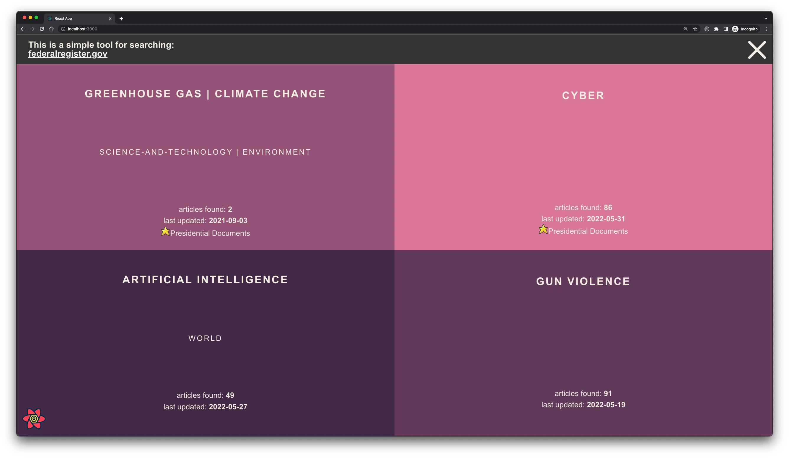
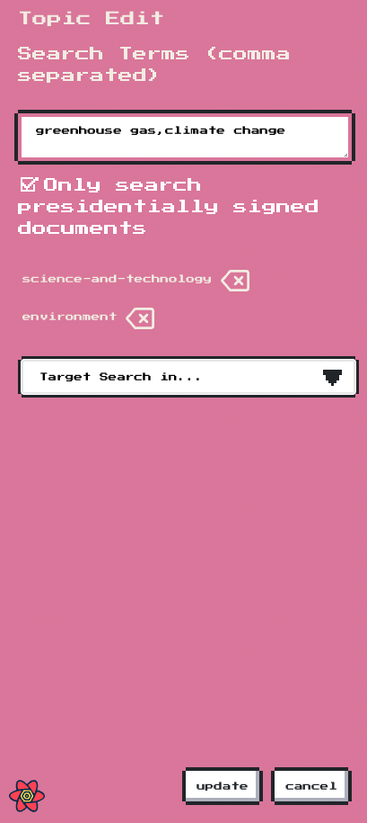

## [https://nomastickles.github.io/federal-register-search/](https://nomastickles.github.io/federal-register-search/)

## [https://federalregister.gov](https://www.federalregister.gov/developers/documentation/api/v1)

## redux-toolkit + useContext + useReducer = ❤️‍🔥




```bash
yarn install && yarn start
```
