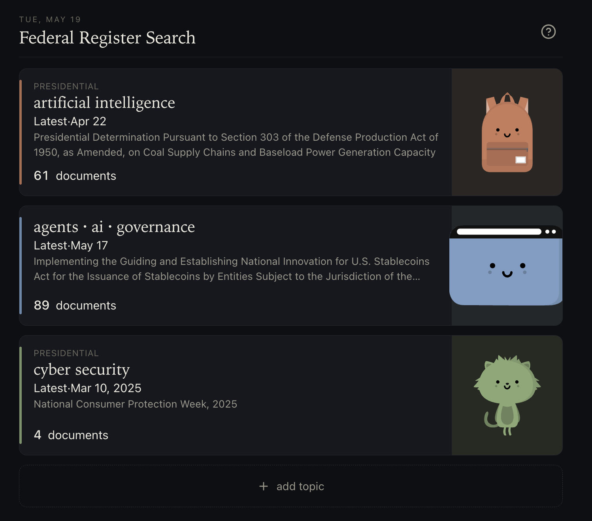

## [https://nomastickles.github.io/federal-register-search/](https://nomastickles.github.io/federal-register-search/)

## [https://federalregister.gov](https://www.federalregister.gov/developers/documentation/api/v1)

## useReducer + useContext + redux-toolkit + react-query = ❤️‍🔥

```bash
yarn install && yarn start
```

---

## Using the Federal Register with AI agents (MCP)

If you want an agent to search the same data this app uses, install an existing Model Context Protocol server.

### Recommended

[**aml25/federal-register-mcp**](https://github.com/aml25/federal-register-mcp) — focused MCP server with tools for executive orders, presidential memoranda, proclamations, rules, agencies, and public-inspection documents. MIT, stdio + HTTP transports.

```bash
git clone https://github.com/aml25/federal-register-mcp.git
cd federal-register-mcp
npm install && npm run build
```

Then wire it into your client:

**Claude Desktop** — `~/Library/Application Support/Claude/claude_desktop_config.json` (macOS) or `%APPDATA%\Claude\claude_desktop_config.json` (Windows):

```json
{
  "mcpServers": {
    "federal-register": {
      "command": "node",
      "args": ["/absolute/path/to/federal-register-mcp/dist/server.js"]
    }
  }
}
```

**Claude Code** — same JSON shape in your `.mcp.json` or via `claude mcp add federal-register -- node /absolute/path/to/federal-register-mcp/dist/server.js`.

### Alternatives

- [**JamesANZ/us-legal-mcp**](https://github.com/JamesANZ/us-legal-mcp) — broader legal MCP that bundles Federal Register search alongside Congress.gov bills and CourtListener opinions.
- [**lzinga/us-gov-open-data-mcp**](https://github.com/lzinga/us-gov-open-data-mcp) — kitchen-sink server covering 40+ U.S. government APIs (Treasury, FRED, FDA, CDC, FEC, etc.) including Federal Register.

### Direct API (no MCP)

The Federal Register API v1 is free and requires no authentication. Useful for one-off agent runs that don't need a persistent server — point an agent's `web_fetch` / `curl` at endpoints like:

```
https://www.federalregister.gov/api/v1/documents.json?conditions[term]=climate&per_page=20&order=newest
https://www.federalregister.gov/api/v1/documents/{document_number}.json
https://www.federalregister.gov/api/v1/agencies
https://www.federalregister.gov/api/v1/public-inspection-documents.json
```

Full reference: [Federal Register API v1 docs](https://www.federalregister.gov/developers/documentation/api/v1).
